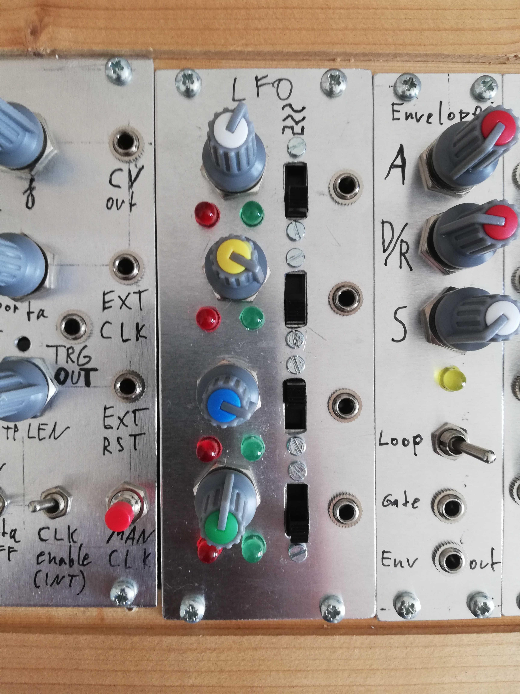

# Vierfach LFO Eurorack Module

This is a quadruple LFO eurorack module.
The original LFO schematic is found in Barry Klein's [Electronic music circuits](https://archive.org/details/electronic-music-circuits/page/n71/mode/2up) on page 70.

Every LFO features a switchable output for pulse, triangle or sine.

See the [pictures](pic/) for the assembly process.
The module is a rough prototype I built for my own purposes and I hope you may find it useful for your own projects.

Manuel Planton 2022
